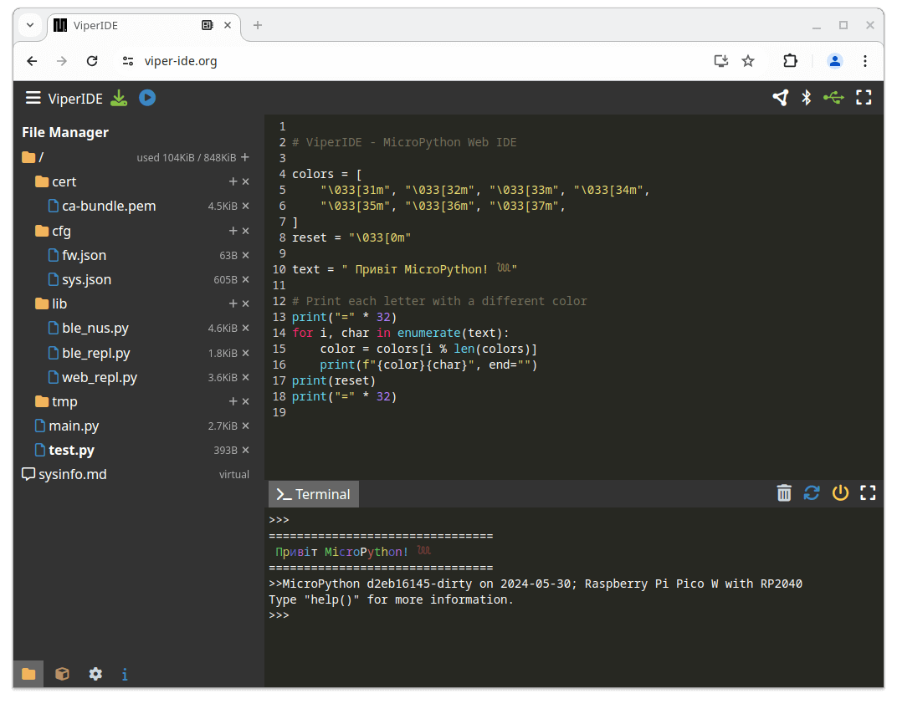

# ViperIDE

<!-- -->
 
 
 
 

**An innovative [MicroPython](https://micropython.org) / [CircuitPython](https://circuitpython.org) IDE for Web and Mobile**

👉 [Open ViperIDE Online](https://viper-ide.org)

## Features

- No software installation required, works out of the box
- Covers most of the functionality of tools like `Thonny`, `mpremote`, `ampy`, `rshell`
- **Multiple ways to connect** on **Windows**, **MacOS**, **Linux**, **Android**, **iOS**, **Chromebook**
  - [`Direct USB / Serial`](docs/USB-Serial-REPL.md)
  - [`WebREPL over internet 🌎`](docs/Web-REPL-Relay.md) - 🚧 *experimental*
  - [`WebREPL in local network`](docs/Web-REPL-Server.md)
  - [`Bluetooth LE`](docs/Bluetooth-REPL.md)
  - [`P2P/WebRTC Bridge`](https://viper-ide.org/bridge.html)
  - [`Virtual Device`](https://viper-ide.org/?vm=1)
- **File Editor**
  - Syntax highlighting for `.py`, `.json`, `.inf`, `.toml`, `.pem`
  - Auto expand/minify of `.json` files
  - Viewer mode for `Markdown`
  - `Hex` viewer for binary files
  - Unicode support (`UTF8`)
  - Run file without saving
- **File Manager**
  - Add, remove files and directories
  - Create multiple levels of directories at once (use multiple "/" in the name)
  - Root FS stats display
  - File upload / download - ⌛ *planned*
- **Package Manager**
  - Official `micropython-lib` index
- **MicroPython compiler**
  - Runs in-browser using WebAssembly
  - Instant syntax check in the editor
  - Saving compiled `.mpy` files - ⌛ *planned*
- **Terminal / REPL**
  - VT100 (ANSI escape sequences) support
  - Snippet support - ⌛ *planned*
- Improved UX
  - Progressive Web App
  - Device and system info display
  - Responsive layout, full screen mode, usable on smartphones
  - Use of natural sorting
  - Localization (generated by AI, **feel free to [improve the translations](./lang)**)

> [!TIP]
> `mpremote` is still a great tool for automation. Learn to use it!

## Supported boards

- Espressif ESP8266, ESP32, ESP32S3, ESP32C3, ESP32C6
- Raspberry Pi Pico W (RP2040)
- Adafruit Feather STM32F405 Express
- Adafruit Feather M0 Basic Proto (ATSAMD21G18)
- WeAct Studio Blackpill v3.1 (STM32F411CE)
- PYBv1.1 (STM32F405RG)
- Seeed Wio Terminal (ATSAMD51P19)
- Seeed XIAO nRF52840 Sense
- Nordic nRF9161 DK with Zephyr port
- PJRC Teensy 4.0 (NXP MIMXRT1062)
- Portenta C33 (Renesas R7FA6M4)
- Micro:bit (nRF51822)
- Micro:bit v2 (nRF52833) with [`CircuitPython`](https://circuitpython.org/board/microbit_v2)
- Air602 (WM W600) with [`robert-hh` port](https://github.com/robert-hh/Shared-Stuff/tree/master/w600_firmware)
- Realtek RTL8721 with [`ambiot` port](https://github.com/ambiot/micropython/releases)

## Links

[ViperIDE Online ](https://viper-ide.org)  
[Documentation](./docs/)  
[Discussion](https://github.com/orgs/micropython/discussions/15219)   
[CodeMirror](https://codemirror.net), [Ruff](https://docs.astral.sh/ruff), [Xterm.js](https://xtermjs.org), [PeerJS](https://peerjs.com)

## Limitations

- `WebUSB` and `WebBluetooth` require a Chrome-based browser like Edge, Opera, Chromium, Brave, etc.
- Older MicroPython versions may or may not work. Keep your MicroPython up to date.
  *That said, ViperIDE has been reported to work with MicroPython v1.13 back from Sep 2020* 🤠
- Some USB devices require drivers installation.
- Some boards are not detected by Android via USB OTG. In such cases, only `BLE`, `WebREPL`, `P2P` connection is possible.
- On iOS, `WebUSB` and `WebBluetooth` are not available. Only `WebREPL` and `P2P` works.

