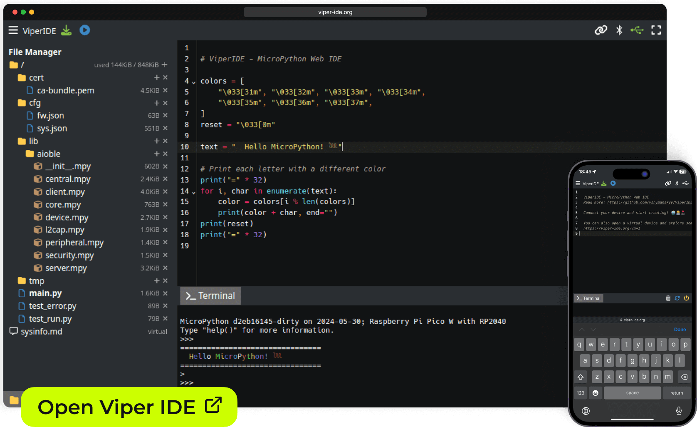

# ViperIDE

<!-- -->
 
 
 
 

**An innovative [MicroPython](https://micropython.org) / [CircuitPython](https://circuitpython.org) IDE for Web and Mobile**

## Features

- **Lightweight and Accessible**
  - Runs entirely in your browser - no installation required
  - Works **offline** on both PC and smartphone
- **Flexible Connectivity**
  - Direct USB connection
  - Wireless/remote options available
- **Powerful Python Development**
  - Real-time code analysis: Spot errors and warnings instantly
  - Integrated Terminal/REPL for interactive coding
  - Basic code completion
  - MicroPython Virtual Machine for experimentation
- **Built-in Management Tools**
  - File explorer and editor
  - Package management system
- ... read more about [features and device support](./docs/Features.md)

## Links

[ViperIDE Online ](https://viper-ide.org)  
[Feedback](./docs/Feedback.md)  
[Documentation](./docs/)  
[Discussion](https://github.com/orgs/micropython/discussions/15219)   
[CodeMirror](https://codemirror.net), [Ruff](https://docs.astral.sh/ruff), [Xterm.js](https://xtermjs.org), [PeerJS](https://peerjs.com)

