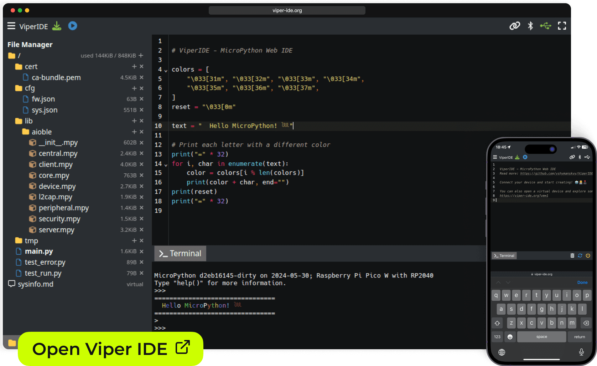

# ViperIDE

 
 
 
 
 
 

**An innovative [MicroPython](https://micropython.org) / [CircuitPython](https://circuitpython.org) IDE for Web and Mobile**

## Features

- **Lightweight and Accessible**
  - Runs entirely in your browser - no installation required
  - Works **offline** on both PC and smartphone
- **Flexible Connectivity**
  - Direct USB connection
  - Wireless/remote options available
- **Powerful Python Development**
  - Real-time code analysis: Spot errors and warnings instantly
  - Integrated Terminal/REPL for interactive coding
  - Basic code completion
  - MicroPython Virtual Machine for experimentation
- **Built-in Management Tools**
  - File explorer and editor
  - Package management system
- ... read more about [features and device support](./docs/Features.md)

## MCP server

[Read More](https://notes.alelec.net/posts/claude-meets-micropython)

## Links

[ViperIDE Online](https://viper-ide.org)  
[Feedback](./docs/Feedback.md)  
[Documentation](./docs/)  
[Discussion](https://github.com/orgs/micropython/discussions/15219)  

## Used software

- [CodeMirror](https://codemirror.net) - Main code editor, MIT
- [Ruff](https://docs.astral.sh/ruff) - Python linter and formatter, MIT
- [Xterm.js](https://xtermjs.org) - REPL Terminal, MIT
- [PeerJS](https://peerjs.com) - P2P/WebRTC connections, MIT
- [MicroPython/PyScript](https://www.npmjs.com/package/@micropython/micropython-webassembly-pyscript) - Virtual Machine, MIT
- [mpy-cross-wasm](https://github.com/vshymanskyy/mpy-cross-wasm) - Code validation and `.mpy` compilation, MIT
- [mpy-tool](https://github.com/micropython/micropython/blob/master/tools/mpy-tool.py) - MPY bytecode disassembler - MIT
- [python-minifier](https://github.com/dflook/python-minifier) - Code minifier, MIT

## Forks and derivative projects

- [Espressif ESP-VISION-IDE](https://ide.vision.espressif.com/) - A low-code [framework and development environment](https://github.com/espressif/esp-vision) for building edge AI and computer-vision applications on Espressif SoCs, with camera capture, image processing, media streaming, model deployment, and AI inference.
- [Jumperless IDE](https://ide.jumperless.org) - A browser-based MicroPython IDE for [JUMPERLESS breadboards](https://www.crowdsupply.com/architeuthis-flux/jumperless-v5), featuring file and package management, REPL connectivity, firmware flashing, device tools, and OLED bitmap conversion.
- [Fri3d-IDE](https://fri3dcamp.github.io/Fri3d-IDE/) - A browser-based [ViperIDE fork](https://github.com/Fri3dCamp/Fri3d-IDE) for developing and publishing MicroPython applications for Fri3d Camp badges.
- [HTLR-MPyRIDE](https://github.com/ArduinoAlvik/HTLR-MPyRIDE) - A customized and extended ViperIDE fork developed for MicroPython education at HTL Rankweil, with a focus on Arduino Alvik and ESP32 devices, browser-based local and remote connectivity, and features adapted for classroom use.
